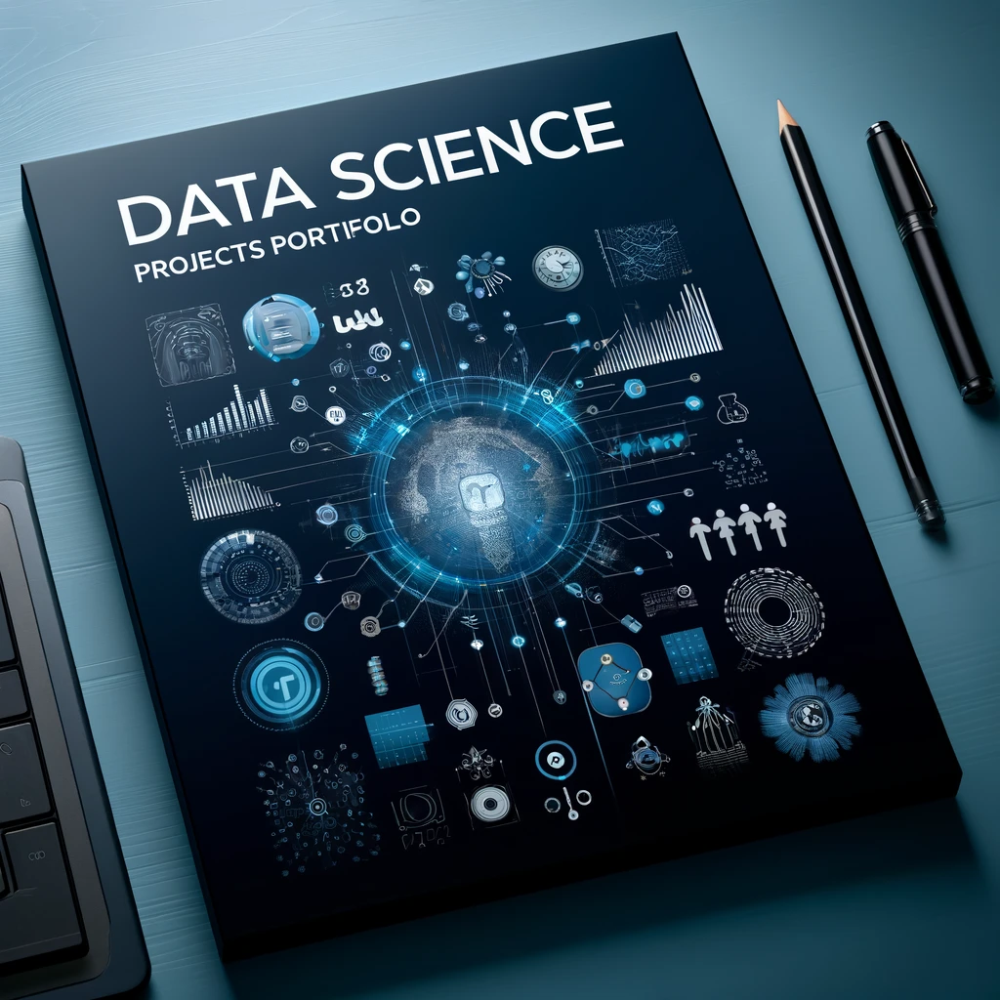

# Emerson's Data Science Portfolio
The main objective of this personal portfolio is to demonstrate my skills in solving business challengs through my knowledge and tools of Data Science.

# Emerson Carlos de Oliveira
*Data Scientist*

Hello! My name is Emerson Carlos de Oliveira and I'm excited to share a little about myself with you. I am a lawyer passionate about challenges and continuous learning, currently in a career transition to the Information Technology area, with the aim of becoming a Data Scientist.

With a solid legal background, I acquired extensive knowledge in compliance, negotiation of agreements and conflict resolution. However, my desire to explore the potential of data and contribute to innovative business solutions led me to seek new horizons in the IT area.

Currently, I am studying Software Engineering and investing in my development through a free Data Science course. This combination of technical knowledge and analytical skills is preparing me to embrace the complex and exciting challenges of the world of data.

My career transition is fueled by my passion for exploring and extracting valuable insights from data. I believe that data analysis is one of the fundamental pillars for making informed decisions and driving the growth of organizations.

I've already had the opportunity to work and master some essential tools, including:
**Analytical Tools:**
**Data Collect and Storage:** Spark(pyspark), SQL
**Databases:**  MySQL, Postgres, SQL Server, Oracle
**Big Data:** Spark Databricks
**Data Processing and Analysis:** Python, R, SQL
**Development:** Git, GitHub, Scrum, Python, SQLite 3
**Operational System:** Windows, Linux
**Data Vizualization:** Power BI, Streamlit, Strelamlit Cloud
**Machine Learning Modeling:** Classification, Regression, Clusterization
**Machine Learning Deployment:** Render Cloud Application Platform, Flask API

I am excited to apply this newly acquired knowledge, along with my legal experience and problem-solving skills, to the field of Data Science. My prior experience as a lawyer has provided a solid foundation in critical thinking, analyzing complex information, and effective communication - transferable skills that will be valuable on my journey as a Data Scientist.

As a professional constantly seeking to improve, I am committed to learning and adopting the latest tools and technologies needed for data analysis. I am confident in my ability to learn quickly and apply my knowledge to challenging projects.

I'm excited to connect with other data science professionals, software engineers, and IT experts. If you're interested in discussing collaboration opportunities, sharing knowledge, or simply exchanging ideas, let's connect. I look forward to embarking on this new phase and contributing to the development of the field of Data Science!

**Links:**
* 
* 

## Data Science Projects:

### [Sales Forecast]( https://github.com/Emerson-C-Oliveira/project_forecast_sales )

Machine Learning and predict next 6 week sales. Company need to identify the sales forecast to next 6 weeks to invest on shops reform.
In this project, I built a Machine Learning regressor to predict sales forecasts with a **margin of error of 9.52%** in relation to actual values.
The model is available in [telegram bot](https://t.me/prediction_rossmann_bot). Send a shop number (30) and he will responde you the sales forecast.

### [Customer priorizing for vehicle insurance cross-sell]( https://github.com/Emerson-C-Oliveira/compra_propensao )

Machine Learning and ranking customers. Company need to prioritizing 20000 customers to call offering a vehicle's Insurance. The model will prioritizing the more probality interesting of acquirin the vehicle insurance of all customer to maximize sales.
The performance of this model bringed **298% increasing than random method, with revenue of U$5,8 millions** according to the company's business model described in the problem definition.
The model API is available in [Render Platform](https://)
